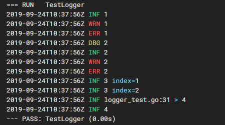

# LogX


## Install

```bash
go get -u github.com/go-sdk/logx
```

## Usage

```go
package main

import (
	"github.com/go-sdk/logx"
)

func main() {
	logx.Debug("1")
	logx.Info("1")
	logx.Warn("1")
	logx.Error("1")

	logx.SetLevel(logx.DebugLevel)

	logx.Debugf("2")
	logx.Infof("2")
	logx.Warnf("2")
	logx.Errorf("2")

	logx.WithField("index", 1).Info("3")
	logx.WithFields(map[string]interface{}{"index": 2}).Info("3")

	l2 := logx.Caller()
	l2.Info("4")
	logx.Info("4")

	logx.Caller(6).Info("5")
}
```

## ScreenShot



## License

[Apache License 2.0](./LICENSE)
